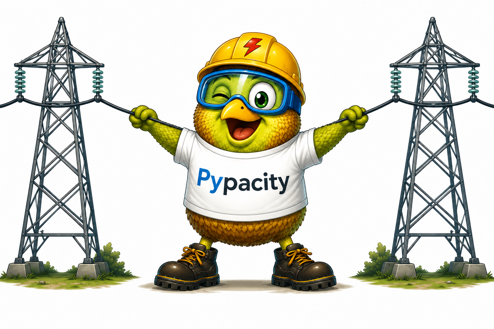

PyPacity
========

.. image:: https://github.com/gteasoft/pypacity/actions/workflows/docs.yml/badge.svg?branch=master
   :target: https://github.com/gteasoft/pypacity/actions/workflows/docs.yml
   :alt: Documentation build

.. image:: https://img.shields.io/badge/status-development-orange.svg
   :target: https://github.com/gteasoft/pypacity
   :alt: Development status

.. image:: https://img.shields.io/badge/license-BSD--3--Clause-blue.svg
   :target: https://github.com/gteasoft/pypacity/blob/master/LICENSE
   :alt: BSD 3-Clause License

.. |nbsp| unicode:: 0xA0
   :trim:

|nbsp|

**PyPacity** is a Python library for computing the ampacity of
overhead electrical conductors.

It implements the IEEE 738 and CIGRE TB 601 methods under
steady-state and transient conditions.

Requirements
------------

PyPacity requires Python 3.9 or newer.

Installation
------------

.. code-block:: console

   git clone https://github.com/mmanana/pypacity.git
   cd pypacity
   pip install .

Documentation
-------------

The complete documentation includes the theoretical formulation,
input and output parameters, and application examples.

.. toctree::
   :maxdepth: 2
   :caption: Contents

   quickstart

